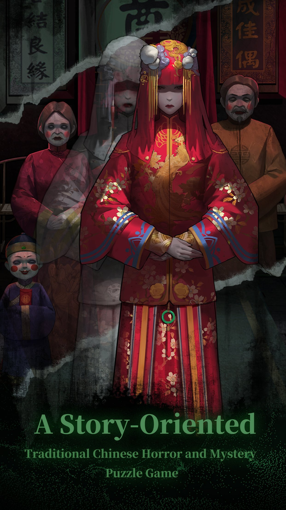
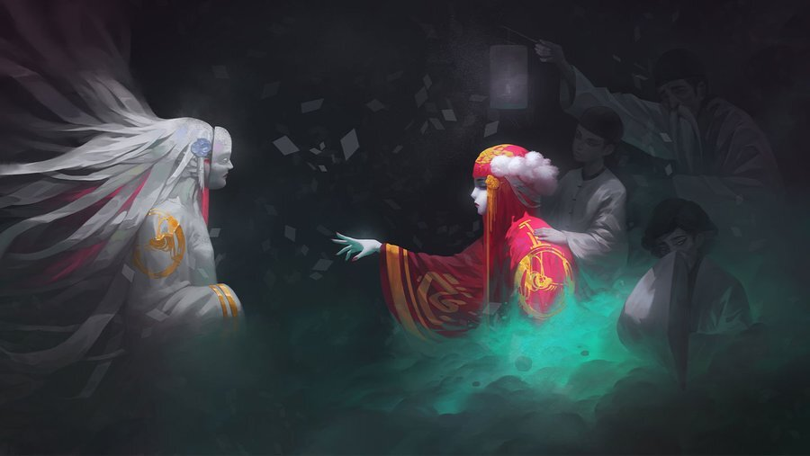

# Le_h_and_Febra_m_folk_horror_games
Horror Video Games
<h2 align="center"><a href="https://store.steampowered.com/app/1735950/Paper_Bride/"> Paper Bride</a></h2>

# About This Game
Paper Bride is a Chinese horror mystery puzzle game which includes traditional Chinese folk cultural elements. Download and experience it if you are interested in traditional Chinese culture.
<h2 align="center">
</h2>

<h3><a href="https://twitter.com/gamefpscom/status/1461632542956687364?s=20"> Inspirations:</a></h3>

There are lots of creative horror stories in traditional Chinese folklore: paper figures blocking the way, underworld spirits marching, bizarre temples, ghost trap... But these elements are rarely used in games. After having nightmares about Strange Tales from a Chinese Studio, Extensive Records of the Taiping Era, A Wicked Ghost and other novels and movies, we think it's a shame that only we could experience the horror, so we made this traditional Chinese horror mystery puzzle game to share with the world.

When the groom turns toward his bride on the wedding ceremony, her traditional red wedding dress suddenly turns into an ominous white paper one before she vanishes without a trace.

